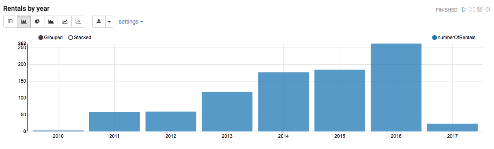

# Analyzing Stadtrad data

## Introduction
[Stadtrad Hamburg](http://stadtrad.hamburg.de) is a (totally awsome!) bike rental service. It turns out you can actually download the usage data using a SOAP API.

## Getting the data
See [my fork of pyABike](https://github.com/frederic-schmaljohann/pyABike) of [pyABike by Ik4ru5](https://github.com/Ik4ru5/pyABike) which calls the Call a Bike SOAP API.

In allRides.py enter your credentials
```python
userName='12345678' # either Kundennummer or telephone number
password=''
```
and run `allRides.py`.

## Loading the data into Apache Zeppelin and analyzing it with Spark/SQL

* Download and run [Apache Zeppelin](https://zeppelin.apache.org/download.html)
* Make sure the [Spark interpreter](https://zeppelin.apache.org/docs/0.7.0/interpreter/spark.html) and the [R interpreter](https://zeppelin.apache.org/docs/0.7.0/interpreter/r.html) work smoothly
* Import the note `stadtrad_rental_data.json`

```scala
import org.apache.commons.io.IOUtils
import java.net.URL
import java.nio.charset.Charset

val ridesText = sc.parallelize(
    IOUtils.toString(
        new URL("file:///<path-to-file>"),
        Charset.forName("utf8")).split("\n"))

case class BikeRides(startDate: String, endDate: String, bikeNumber: Int)

val ride = ridesText.map(s => s.split(",")).map({
    s => BikeRides(
            s(0),
            s(1),
            s(2).trim().toInt
        )}
).toDF()
ride.registerTempTable("ride")
```

**Sample SQL query on the data:**
```sql
%sql 
select date_format(startDate, 'EEEE') as weekday, count(1) as numberOfRentals
from ride
group by date_format(startDate, 'EEEE')
order by numberOfRentals desc
```

## Analyzing the data
**Duration of rentals over time**: I happen to use Stadtrad mostly for commuting, therefore when I switch workplaces the average duration per day is likely to change. For example, since 1st of January, 2017 I have a about 10 minutes longer bike ride to work :)
Peaks over 25 minutes appear almost exclusively on weekends.


**Usage per weekday**: Thursdays seems to be my preferred day.


Let's take a look at the **usage per month** (full years only, 2011-2016): I have taken the most rides in September and the least in February.


I have rented a few bikes multiple times...


My Stadtrad usage seems to increase over time when looking at the years.



**Usage by hour of day**: most rides during rush hour


**Rental duration by day: Min, Max, 25%- ,75%- percentile**


Finally, my **total usage duration** is 212:46 hours during 883 rides.
